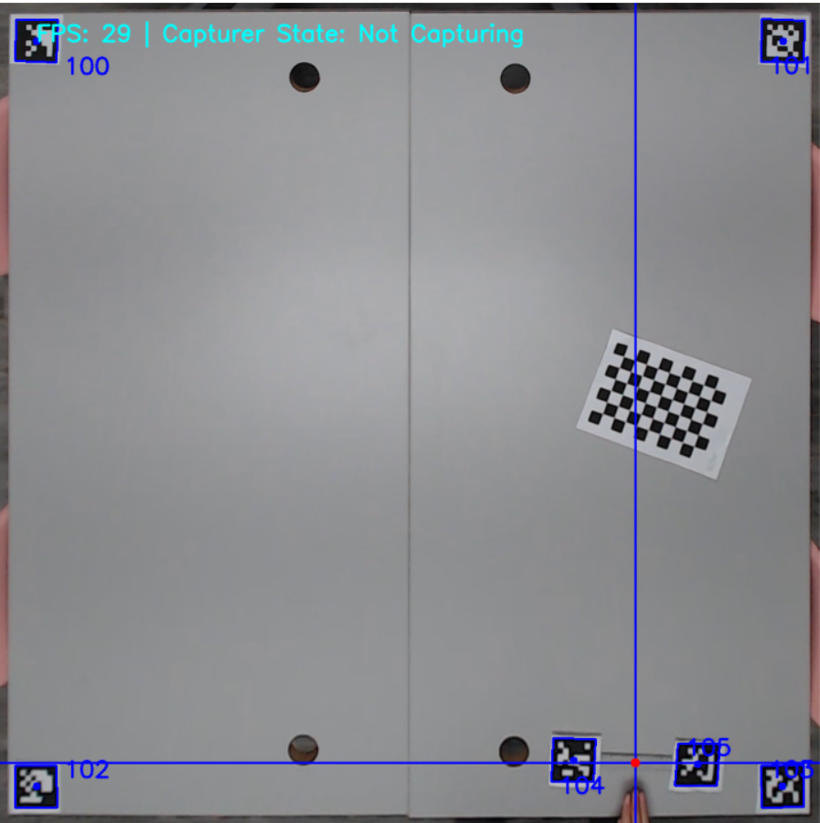
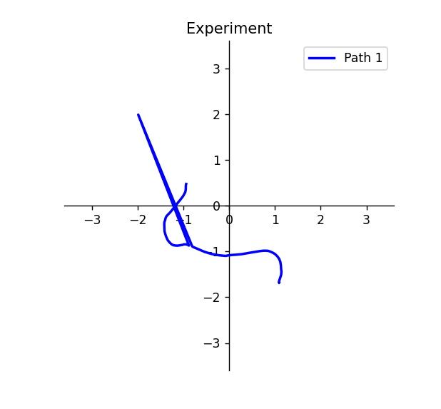
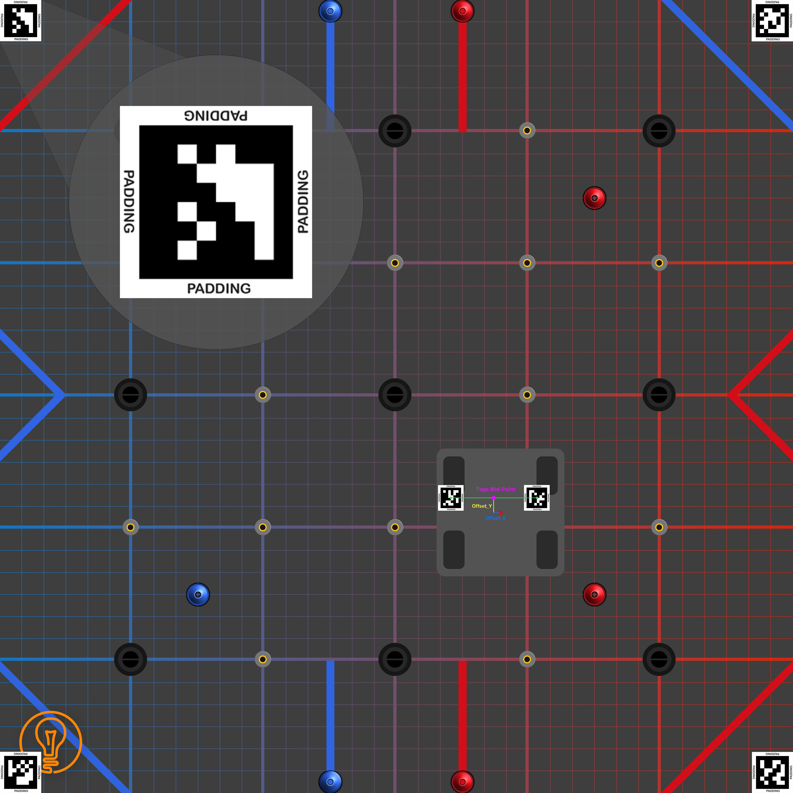
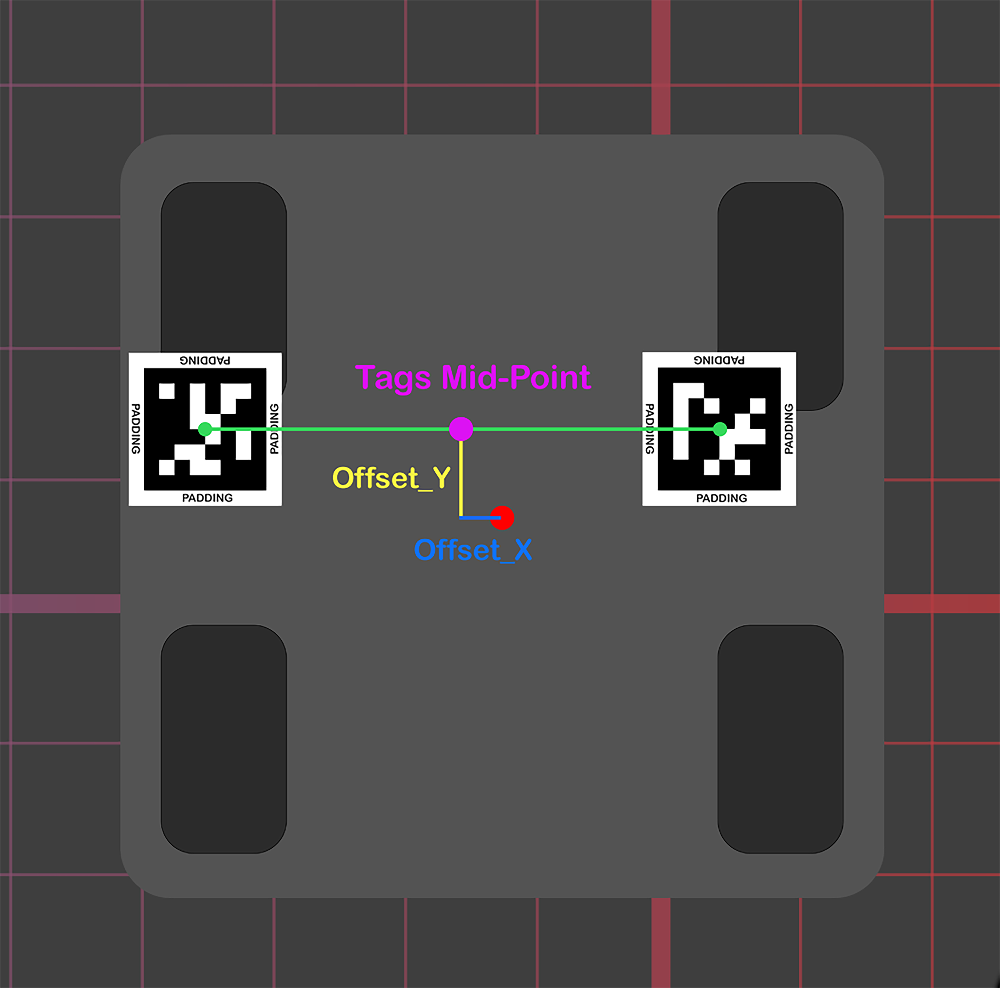

# Robot Autotuner
By The Inventors #20131 Angelos Theodoridis([GitHub](https://github.com/Agtheo09))

## About
This program is only for testing purposes and on a match is not legal. It's a powerful way to tune your PIDF Feedforward Values for the Robot. Saves up a lot of time and it's also really accurate if it is set up well.

Note: This is a default program... If you are planning to use it for your robot and field you might need to change some parts of the code to make it suitable for your needs.

We are open to suggestions and feedback so feel free to contact us.

 | 
-|-


 


# Table of Contents
1. [Building Environment](#a-building-the-experimenting-space)
2. [Software Installation](#b-software-installation)
3. [Camera Calibration](#c-camera-calibration)
4. [Project Structure](#d-project-structure)

# A. Building the Experimenting Space...
Soooooooooo...
## Step 1: Mounting the Camera
Mount a Camera, which you can use through your computer, on the ceiling facing down and make sure that the field is completely visible from the camera.

## Step 2: Collect and Print the Tags
* Find on the internet some AprilTags that are part of the 36h11 family of tags with known ids and print the in a piece of paper. (there are 10 tag examples in the imgs/apriltags directory)
* Trace out the tags and cut them with a pair of scissors.
**Attention!: Make sure that you leave some padding of white paper around the tags!**

## Step 3: Place the Tags 
Next step is to place the tags on the field and on the robot. Place 4 tags in each corner of the field. Then place 2 tags on top of the robot. Also, measure the tags mid-point offset from the center of the robot.(take a look at the 2 pictures below)

 | 
-|-

Note: 
1. You can place a single tag in the robot but then the heading calculation won't be available so we recommend 2
2. You might have to play around with the sizes of the tags so that are visible and detectable from the camera.

## Step 4: Gather Necessary Info:
You will also need to gather some information in order in input it to the program. The info is the following:
* All Tags Ids(specify these in the contants.json file)
* Tags Mid-Point Offset from the center of the robot(this should be specified in the init method of the Localizer Class)


# B. Software Installation
## Step 1: Download the repository ZIP file
Extract the .zip file somewhere that you like to store it.
## Step 2: Install the required libraries for the project
Open the command line/terminal in your repo/folder and run the following command: 
```pip install -r requirements.txt```
### Just in case you use conda:
1. Open Anaconda Prompt
(we suggest that you create a new environment only for the Robot-Autotuner)
3. Locate the repo/folder ```cd [PATH]```
4. Then run the following command: 
```conda install -r requirements.txt```
In case the enviroment has an error solving it.
    * Activate the Robot-Autotuner environment by running ```conda activate [ROBOT_AUTOTUNER_ENV_NAME]```
    * Locate your repo/folder if you haven't already
    * Then run the following command: 
    ```pip install -r requirements.txt```
# C. Camera Calibration

# D. Project Structure
In order to keep the code simple and organized the whole program is divided in classes:
1. [**Apriltagging**](https://github.com/theinventors-ftc/robot-autotuner/blob/main/src/Apriltagging.py) - This class is responsible for the Apriltag detection.

2. [**Localizer**](https://github.com/theinventors-ftc/robot-autotuner/blob/main/src/Localizer.py) - This class is responsible for localizing the robot in side the field and calculate some kinematics such as <u>pose(x, y, θ) and velocity</u>.

3. [**Path Capturer**](https://github.com/theinventors-ftc/robot-autotuner/blob/main/src/PathCapturer.py) - This class continuously captures the robots position into a series of poses to make a path.

4. [**Datalogger**](https://github.com/theinventors-ftc/robot-autotuner/blob/main/src/Datalogger.py) - Cooperates with **Path Capturer** to log/save the robots pose together with a timestamp in a csv file so we can analyze it later on.

5. [**Visualizer**](https://github.com/theinventors-ftc/robot-autotuner/blob/main/src/Visualizer.py) - Takes a path as an input and visualizes it in a 2D plane using **MatPlotLib** Python Library.

6. [**Path Evaluator**](https://github.com/theinventors-ftc/robot-autotuner/blob/main/src/PathEvaluator.py) - Contains some useful functions for analyzing a path such as Path Interpolation, Path Linearity and Start vs Stop Pose Difference.

7. [**Video Stream**](https://github.com/theinventors-ftc/robot-autotuner/blob/main/src/VideoStream.py) - Is a class that run in parallel with the main loop of the program and uses Frame Buffering Algorithm to make video capturing/streaming faster by a huge factor.
   
8. [**Camera Calibrator**](https://github.com/theinventors-ftc/robot-autotuner/blob/main/src/CameraCalibrator.py) - This is a class that calibrates the camera for fish-eye distortion as well as perspective misalignments

## D.1 File Structure 
The Project/File Structure looks something like this:


